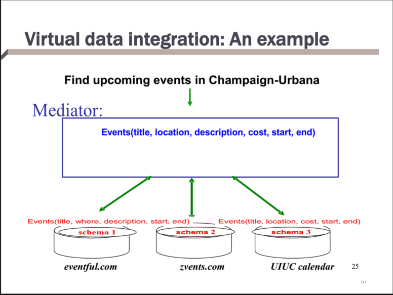
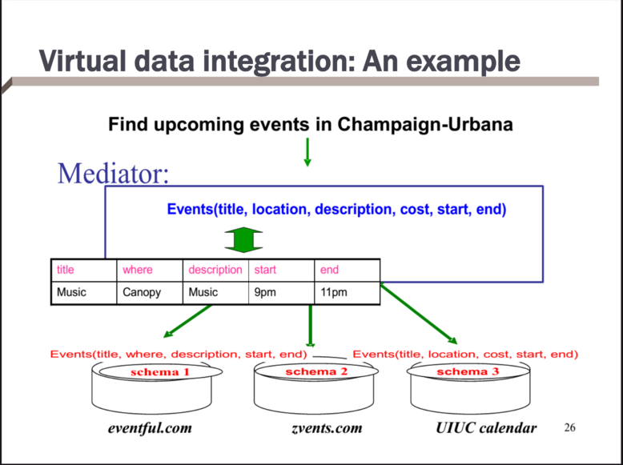
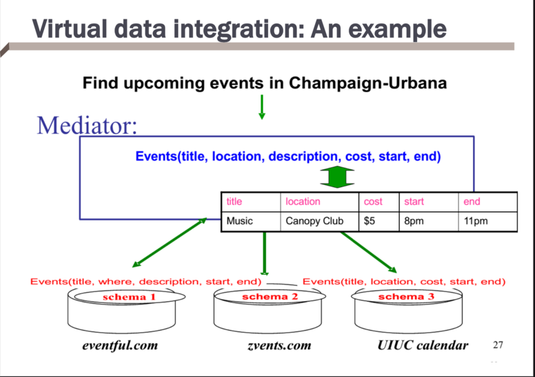
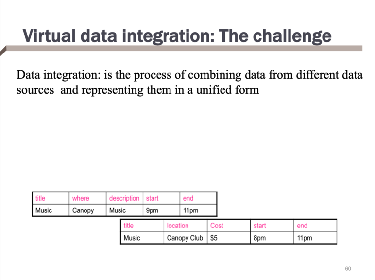
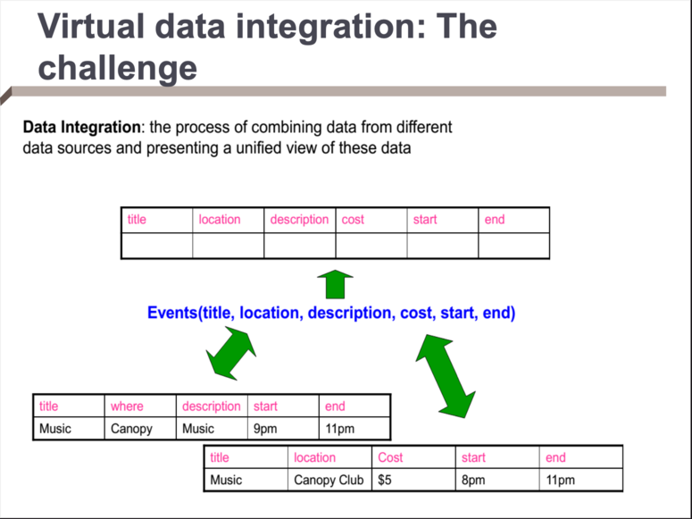
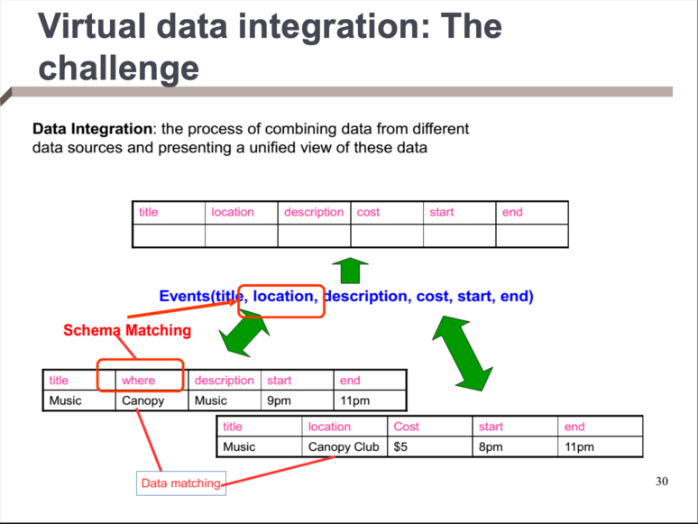

# Mediated Schema

* Leave the data in local sources
* When a query comes in:
    * Determine the relevant sources to the query
    * Break down the query into sub-queries for the sources
    * Get the answers from the sources, and combine them appropriately
* Data is fresh

# Example

